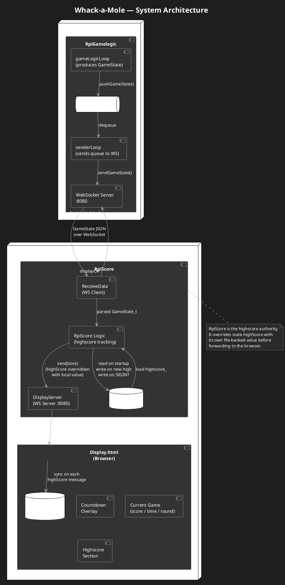
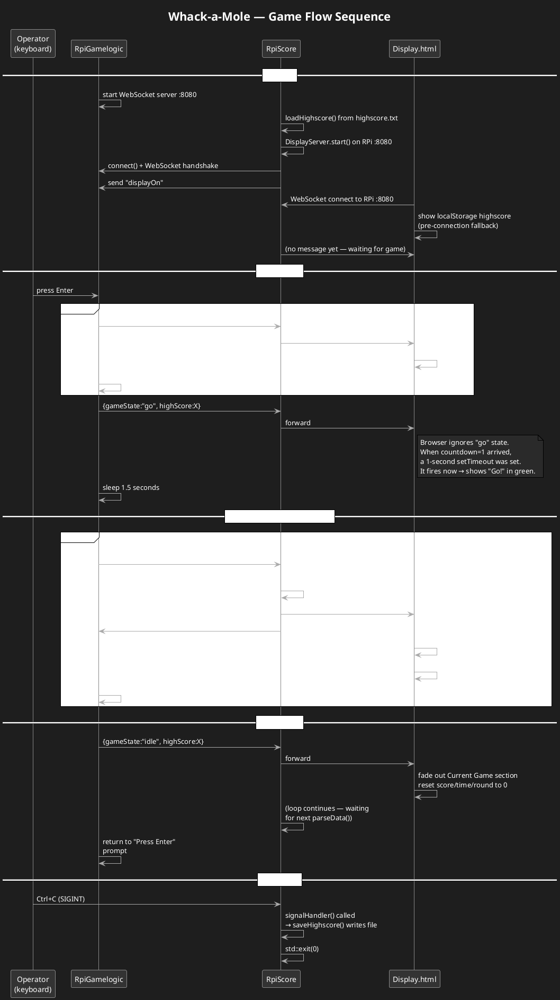
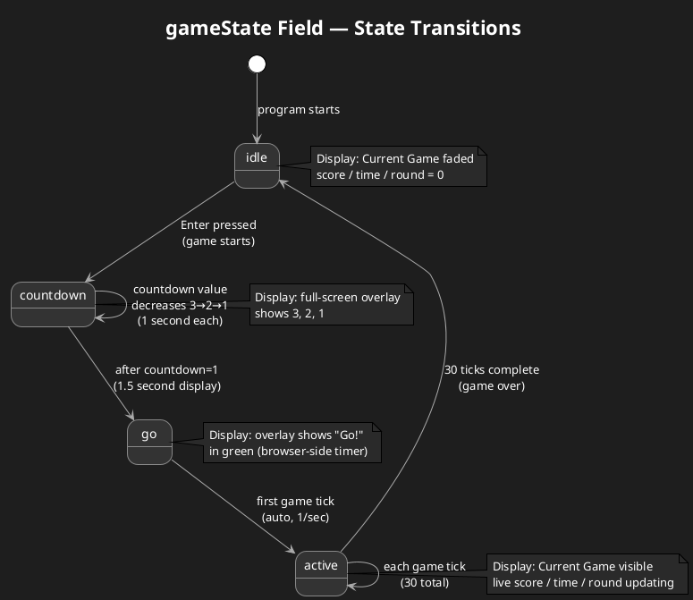

# Whack-a-Mole WebSocket System — Complete Technical Overview

## Table of Contents

1. [System Purpose](#1-system-purpose)
2. [Architecture Overview](#2-architecture-overview)
3. [Component Descriptions](#3-component-descriptions)
   - [RpiGamelogic](#31-rpigamelogic)
   - [RpiScore](#32-rpiscore)
   - [Display.html](#33-displayhtml)
4. [The GameState Protocol](#4-the-gamestate-protocol)
5. [Game Flow — Step by Step](#5-game-flow--step-by-step)
6. [Highscore System](#6-highscore-system)
7. [WebSocket Communication in Detail](#7-websocket-communication-in-detail)
8. [Threading Model](#8-threading-model)
9. [Network Configuration](#9-network-configuration)
10. [Build Instructions](#10-build-instructions)
11. [PlantUML Diagrams](#11-plantuml-diagrams)

---

## 1. System Purpose

This project implements the scoring and display system for a physical Whack-a-Mole arcade game. The game hardware is controlled by a separate team. This codebase handles:

- Receiving live game state from the game controller over a local network
- Tracking and persisting the all-time highscore across sessions
- Displaying the current score, time, round, and highscore on an external screen connected to a Raspberry Pi

---

## 2. Architecture Overview

The system is split into **three components** that communicate over WebSockets:

```
RpiGamelogic          RpiScore                 Display.html
(Game PC / RPi)  -->  (RPi, bridge)  -->  (Browser on RPi's screen)
WebSocket server      WS client +              WebSocket client
                      WS server
```

The key design decision is that **RpiScore is a bridge**: it sits in the middle, connects to both the game server and the browser, and is responsible for highscore persistence. The browser only ever talks to RpiScore, never directly to RpiGamelogic.

**Why a bridge?**
- The game logic runs on a different machine from the display
- The RPi needs to persist highscore locally to a file
- The browser display needs a consistent, local WebSocket endpoint (the RPi's own IP)
- RpiScore can enrich the data (e.g. overriding the highscore with its locally-persisted value) before forwarding to the browser

---

## 3. Component Descriptions

### 3.1 RpiGamelogic

**Location:** `RpiGamelogic/`  
**Language:** C++  
**Runs on:** Game PC or RPi  
**Role:** WebSocket server, game logic, state broadcaster

#### What it does

RpiGamelogic is the **source of truth** for all live game data. It runs a WebSocket server on port 8080 and broadcasts `GameState_t` objects (serialised as JSON) to any connected client.

#### Internal structure

RpiGamelogic runs **three concurrent threads**:

| Thread | Purpose |
|---|---|
| Main thread | Runs the RESTinio WebSocket server, handles incoming connections |
| `senderLoop` thread | Waits for states in a thread-safe queue, sends them over WebSocket |
| `gameLogicLoop` thread | Produces game states and pushes them into the queue |

#### Thread-safe queue

The game logic and the WebSocket sender run on separate threads. They communicate through a shared queue protected by a mutex and a condition variable:

```cpp
std::queue<GameState_t>  g_stateQueue;   // the shared queue
std::mutex               g_queueMutex;  // protects the queue
std::condition_variable  g_cv;          // signals when new data is available
```

- `gameLogicLoop` calls `pushGameState()` to add a state to the queue and notify the sender
- `senderLoop` blocks on `g_cv.wait()` until there is something in the queue, then pops and sends it

This decouples game timing from network timing. The game logic can run at any speed without blocking on the WebSocket send.

#### WebSocket handle

The active client connection is stored in a global handle:

```cpp
rws::ws_handle_t g_ws_handle;
std::mutex       g_wsMutex;
```

`g_ws_handle` is set when a client connects and reset to null when it disconnects. `sendGameState()` checks whether the handle is valid before sending and discards the state if no client is connected.

#### The game logic loop (simulation)

The current `gameLogicLoop` is a **placeholder simulation** — it will be replaced by real hardware input from the other team. It behaves as follows:

1. Wait for Enter key press → start a new game
2. Send countdown states (3, 2, 1) automatically, 1 second apart
3. Send a `"go"` state for 1.5 seconds
4. Run the game for 30 ticks, one per second, automatically
5. Send an `"idle"` state when the game ends
6. Return to step 1

In the real implementation, steps 2–5 will be driven by physical hardware events rather than timers and keyboard input.

---

### 3.2 RpiScore

**Location:** `RpiScore_struktureret/`  
**Language:** C++  
**Runs on:** RPi  
**Role:** Bridge between RpiGamelogic and the browser, highscore persistence

#### What it does

RpiScore connects **outward** to RpiGamelogic as a WebSocket client, and **inward** to the browser as a WebSocket server. Every `GameState_t` it receives from RpiGamelogic is processed, enriched with the locally-tracked highscore, and forwarded to the browser.

#### Internal class structure

```
RpiScore          — top-level orchestrator
├── ReceiveData   — WebSocket client connecting to RpiGamelogic
├── DisplayServer — WebSocket server serving Display.html
└── Display       — terminal output for debugging
```

#### RpiScore — main loop

```cpp
void RpiScore::run()
{
    loadHighscore();        // read highscore.txt into highscore_
    displayServer_.start(); // start listening for browser

    receiveData_.connect(); // connect to RpiGamelogic

    GameState_t state;
    while (receiveData_.parseData(state))   // blocking: wait for next message
    {
        getData(state.time, state.round, state.score, state.highScore);
        state.highScore = highscore_;       // override with locally-tracked value
        displayServer_.sendJson(json_dto::to_json(state)); // forward to browser
        receiveData_.sendDisplayUpdated();  // acknowledge back to RpiGamelogic
    }

    saveHighscore(); // save on clean disconnect
}
```

The loop is entirely synchronous and single-threaded (except for `DisplayServer`'s accept thread). It processes one message at a time: receive → update highscore → forward → acknowledge.

#### ReceiveData — WebSocket client (manual implementation)

`ReceiveData` implements the WebSocket client **from scratch** using raw TCP sockets, without a library. This is because the RPi needed a lightweight client implementation.

**Connection sequence:**

1. Create a TCP socket and connect to RpiGamelogic's IP on port 8080
2. Send an HTTP/1.1 upgrade request (the WebSocket handshake):
   ```
   GET / HTTP/1.1
   Host: <ip>
   Upgrade: websocket
   Connection: Upgrade
   Sec-WebSocket-Key: dGhlIHNhbXBsZSBub25jZQ==
   Sec-WebSocket-Version: 13
   ```
3. Verify the server responds with HTTP 101 Switching Protocols
4. The connection is now a raw WebSocket — all subsequent communication uses the WebSocket frame format

**Frame parsing (`extractPayload`):**

WebSocket messages are wrapped in a binary frame format. `extractPayload` manually decodes this:

- Byte 0: flags + opcode (0x81 = final frame, text)
- Byte 1: mask flag + payload length
  - If length = 126, the actual length is in the next 2 bytes
- If the MASK bit is set (client→server messages always are), 4 masking bytes follow
- Payload bytes are XOR'd with the masking key to decode them

Control frames (ping/pong) carry no meaningful payload. `parseData` skips empty payloads and loops to read the next frame rather than terminating, ensuring ping frames from the server do not kill the game session.

**Sending frames (`sendFrame`):**

When sending from client to server (e.g. `"displayUpdated"`), the WebSocket spec requires the client to **mask** the payload. `sendFrame` XORs each byte with a fixed 4-byte mask key before sending.

#### DisplayServer — WebSocket server

`DisplayServer` is a minimal WebSocket server that listens for browser connections on port 8080 (the RPi's own port). It runs its accept loop on a background thread so it does not block the main RpiScore loop.

**Handshake (RFC 6455):**

When a browser connects, `doHandshake` performs the WebSocket server-side handshake:

1. Read the browser's HTTP upgrade request
2. Extract the `Sec-WebSocket-Key` header
3. Concatenate it with the fixed magic string `258EAFA5-E914-47DA-95CA-C5AB0DC85B11`
4. SHA-1 hash the result
5. Base-64 encode the hash → this becomes the `Sec-WebSocket-Accept` response header
6. Send HTTP 101 response — the connection is now a WebSocket

This handshake uses OpenSSL for the SHA-1 computation.

**Sending to browser:**

`sendJson` takes a JSON string, wraps it in a WebSocket text frame (opcode 0x81), and sends it over the socket. Server-to-client frames do NOT use masking (only client-to-server messages must be masked per the spec).

If the send fails (browser disconnected), `clientSock_` is set to -1 and subsequent sends are silently dropped until the browser reconnects.

#### Display — terminal output

`Display` simply prints game state to the RPi's terminal. It is used for debugging — you can see score, time, round, and highscore in the console while the game runs. It has no effect on what the browser sees.

---

### 3.3 Display.html

**Location:** `Display.html` (project root)  
**Language:** HTML + CSS + JavaScript  
**Runs on:** Browser on the RPi's external screen  
**Role:** Visual display for players

#### What it does

Display.html opens in a browser connected to an external screen. It maintains a WebSocket connection to RpiScore and updates the UI in real time based on incoming game state messages.

#### Layout

The page has two visual sections:

**Current Game** (fades in/out based on game state):
- Score — the running score for the current game
- Time — remaining seconds
- Round — current round number

**Highscore** (always visible):
- All-time Best — the highest score ever recorded

A full-screen **countdown overlay** appears during the pre-game sequence, showing 3 → 2 → 1 → Go! before fading away when the game starts.

#### State machine in JavaScript

The `onmessage` handler drives the UI based on `data.gameState`:

| `gameState` | Overlay | Game section | Values updated |
|---|---|---|---|
| `"countdown"` | Visible (shows number) | Faded out | highscore only |
| `"idle"` | Hidden | Faded out | Resets score/time/round to 0 |
| `"active"` | Hidden | Visible | score, time, round, highscore |

**"Go!" is handled client-side:** when `countdown === 1` arrives, a 1-second `setTimeout` fires and changes the overlay text to "Go!" in green. This is more reliable than waiting for a server message because it cannot be affected by network timing.

#### Highscore handling

`localStorage` is used as a pre-connection fallback — when the page loads before the server sends its first message, it shows the last known highscore from the previous session. Once the server sends any message containing `highScore`, `localStorage` is immediately synced to that value. The server (RpiScore) is always the authoritative source of truth.

---

## 4. The GameState Protocol

All three components share the same data structure. RpiGamelogic serialises it to JSON; RpiScore deserialises and re-serialises it; Display.html parses the JSON in JavaScript.

### JSON fields

| Field | Type | JSON key | Mandatory (server) | Notes |
|---|---|---|---|---|
| `score` | int | `"score"` | Yes | Current game score |
| `round` | int | `"round"` | Yes | Current round number |
| `time` | int | `"time"` | Yes | Remaining seconds |
| `gameState` | string | `"gameState"` | Yes | See game states below |
| `highScore` | int | `"highScore"` | Yes (server) / Optional (RpiScore) | All-time best |
| `countdown` | int | `"countdown"` | Yes (server) / Optional (RpiScore) | Countdown value (3/2/1), 0 otherwise |

### gameState values

| Value | Meaning |
|---|---|
| `"idle"` | No game running. Waiting for the next game to start. |
| `"countdown"` | Pre-game countdown in progress. `countdown` field holds 3, 2, or 1. |
| `"go"` | Transitional state sent briefly after countdown ends, before first active tick. |
| `"active"` | Game is running. `score`, `time`, `round` are live. |

### Example messages

**Countdown tick:**
```json
{"score":0,"round":0,"time":0,"gameState":"countdown","highScore":290,"countdown":3}
```

**Active game tick:**
```json
{"score":150,"round":2,"time":15,"gameState":"active","highScore":290,"countdown":0}
```

**New highscore set:**
```json
{"score":300,"round":3,"time":1,"gameState":"active","highScore":300,"countdown":0}
```

**Game over:**
```json
{"score":0,"round":0,"time":0,"gameState":"idle","highScore":300,"countdown":0}
```

### Mandatory vs Optional

In `RpiGamelogic/GameState.hpp` all fields are `mandatory` — the server always sends every field in every message.

In `RpiScore_struktureret/include/GameState.hpp`, `highScore` and `countdown` are `optional` (defaulting to 0). This makes RpiScore resilient: if it is ever run against an older version of RpiGamelogic that does not send these fields, it will not crash.

---

## 5. Game Flow — Step by Step

### Step 1 — Startup

1. **RpiGamelogic** starts on the game PC, opens port 8080, and spawns its sender and game logic threads. It prints `"Press Enter to start a new game..."` and waits.
2. **RpiScore** starts on the RPi. It:
   - Reads `./highscore.txt` (relative to where the binary is run from, i.e. `build/`) into `highscore_`
   - Starts `DisplayServer` listening on port 8080 (the RPi's port)
   - Connects to RpiGamelogic via `ReceiveData`
   - Sends `"displayOn"` to RpiGamelogic to signal it is ready
3. **Display.html** opens in the browser, connects to `ws://<RPi-IP>:8080`, and shows the stored highscore from `localStorage` while waiting.

### Step 2 — Game Start (Enter pressed on RpiGamelogic)

The operator presses Enter on the RpiGamelogic machine. The game logic loop begins:

```
t=0s   Push countdown=3  → RpiScore → Display (overlay shows "3")
t=1s   Push countdown=2  → RpiScore → Display (overlay shows "2")
t=2s   Push countdown=1  → RpiScore → Display (overlay shows "1")
                            Display starts 1s browser-side timer
t=3s   Push gameState=go → (server-side 1.5s pause)
t=3s   Browser timer fires → overlay changes to "Go!" (green)
t=4.5s Push active tick 1 → RpiScore → Display (overlay hides, game section appears)
```

### Step 3 — Active Gameplay (30 seconds)

Every second, RpiGamelogic pushes a new `"active"` state:

```
tick 0:  score=10,  time=30, round=1
tick 1:  score=20,  time=29, round=2
tick 2:  score=30,  time=28, round=3
tick 3:  score=40,  time=27, round=1   ← round cycles every 3 ticks
...
tick 29: score=300, time=1,  round=3
```

For each tick:
1. RpiGamelogic pushes state to its queue
2. `senderLoop` sends it to RpiScore via WebSocket
3. RpiScore's `parseData` receives and decodes the frame
4. `getData` checks if `data.highScore` or `data.score` beats the current `highscore_`; saves to file if a new high is set
5. `state.highScore` is overwritten with RpiScore's tracked value
6. The full state is serialised and sent to Display.html via `DisplayServer`
7. RpiScore sends `"displayUpdated"` back to RpiGamelogic as an acknowledgement
8. Display.html receives the JSON, updates score/time/round/highscore on screen

### Step 4 — Game Over

After 30 ticks, RpiGamelogic sends `gameState: "idle"`:

1. Display.html fades out the Current Game section and resets score/time/round to 0
2. The highscore section remains visible with the all-time best
3. RpiScore's `parseData` loop continues waiting for the next message
4. RpiGamelogic returns to waiting for Enter

### Step 5 — Shutdown

When RpiScore is stopped with Ctrl+C, the SIGINT handler calls `saveHighscore()` before exiting, ensuring the highscore is written to disk even if the session ends abruptly.

---

## 6. Highscore System

The highscore flows through the system as follows:

### Storage locations

| Location | Type | Persists across restarts? |
|---|---|---|
| `int highScore` in `gameLogicLoop` | In-memory | No — resets to 0 when RpiGamelogic restarts |
| `int highscore_` in `RpiScore` | In-memory | No — loaded from file on startup |
| `build/highscore.txt` | File on RPi | Yes — survives reboots |
| `localStorage['highscore']` in browser | Browser storage | Yes — survives page reloads |

### Update logic in RpiScore

```cpp
void RpiScore::getData(int time, int round, int score, int highScore)
{
    // 1. If the server's session highscore is higher than our file-loaded value, adopt it
    if (highScore > highscore_)
        highscore_ = highScore;

    // 2. If the current score beats everything we've seen, save to file immediately
    updateHighscore(score);
}
```

`updateHighscore` writes to `highscore.txt` the moment a new high is achieved — not just at the end of the session. This means a power cut mid-game still preserves any new record.

### Why RpiScore overrides the server's highScore

RpiGamelogic's `highScore` only spans the current server process. If RpiGamelogic restarts, its `highScore` resets to 0. RpiScore loads the true all-time best from the file and **always sends its own `highscore_` value** to the browser, overwriting whatever the server sent:

```cpp
state.highScore = highscore_;  // always use our file-backed value
displayServer_.sendJson(json_dto::to_json(state));
```

### Resetting the highscore manually

1. On the RPi, edit `RpiScore_struktureret/build/highscore.txt` and set it to `0`
2. In the browser console (F12), run `localStorage.clear()` and refresh
3. Restart RpiScore — it loads 0 from the file and the display shows 0

---

## 7. WebSocket Communication in Detail

### Connection 1: RpiGamelogic ↔ RpiScore

- **Protocol:** WebSocket over TCP
- **Port:** 8080 on the RpiGamelogic machine
- **Direction of data:** RpiGamelogic → RpiScore (game states)
- **Direction of acknowledgements:** RpiScore → RpiGamelogic (`"displayOn"`, `"displayUpdated"`)
- **Implementation:** RpiGamelogic uses the RESTinio library; RpiScore uses a manual raw-socket implementation
- **Frame format:** Standard RFC 6455 WebSocket frames. Client-to-server frames (from RpiScore) are masked; server-to-client frames (from RpiGamelogic) are not

### Connection 2: RpiScore ↔ Display.html

- **Protocol:** WebSocket over TCP
- **Port:** 8080 on the RPi
- **Direction of data:** RpiScore → Display.html (forwarded game states with corrected highscore)
- **Implementation:** Both sides use standard WebSocket — DisplayServer is a manual implementation; the browser uses the native `WebSocket` API
- **Frame format:** RFC 6455. Server-to-client frames (from DisplayServer) are not masked; the browser's client-to-server connection upgrade is standard

### Why port 8080 on both connections?

Both connections use port 8080, but on **different machines**:
- Connection 1 uses port 8080 on the **game PC** (RpiGamelogic's machine)
- Connection 2 uses port 8080 on the **RPi** (RpiScore's machine)

There is no conflict because they are on different hosts.

---

## 8. Threading Model

### RpiGamelogic threads

```
Main thread:       RESTinio server — handles WebSocket upgrade and incoming messages
senderLoop thread: Blocks on condition variable, sends states from queue
gameLogicLoop:     Produces states, pushes to queue, sleeps between ticks
```

The queue + condition variable pattern means `gameLogicLoop` never blocks waiting for the network. If RpiScore is slow or disconnected, states accumulate in the queue and drain when the connection is restored.

### RpiScore threads

```
Main thread:      ReceiveData loop — receive → process → sendJson → acknowledge
acceptThread:     DisplayServer — accepts new browser connections in the background
```

The main loop and the accept thread share `clientSock_` protected by `clientMutex_`. The main thread calls `sendJson` (which takes the lock) and the accept thread calls `acceptLoop` (which also takes the lock when replacing `clientSock_`).

---

## 9. Network Configuration

| Component | Runs on | IP | Port |
|---|---|---|---|
| RpiGamelogic | Game PC | Any | 8080 |
| RpiScore (client side) | RPi | — | connects to game PC port 8080 |
| RpiScore (server side) | RPi | RPi's IP | 8080 |
| Display.html | Browser on RPi | — | connects to `ws://<RPi-IP>:8080` |

**Current hardcoded IP in Display.html:**
```javascript
const socket = new WebSocket("ws://172.20.10.12:8080");
```
This must match the RPi's actual IP address. Update it if the network changes.

**RpiGamelogic's IP** is passed as a command-line argument to RpiScore:
```bash
./client <IP_of_RpiGamelogic>
```

---

## 10. Build Instructions

### RpiScore (on the RPi)

**Dependencies:**
```bash
sudo apt-get install libssl-dev
```

**Build with CMake:**
```bash
cd RpiScore_struktureret
mkdir -p build && cd build
cmake .. && make
./client <IP_of_RpiGamelogic>
```

**Build with g++ directly:**
```bash
cd RpiScore_struktureret
g++ -std=c++17 -Iinclude -Iexternal/json_dto -Iexternal/rapidjson \
    -pthread src/main.cpp src/RpiScore.cpp src/Display.cpp \
    src/ReceiveData.cpp src/DisplayServer.cpp \
    -lssl -lcrypto -o build/client
./build/client <IP_of_RpiGamelogic>
```

The `highscore.txt` file is created at `build/highscore.txt` (relative to where the binary runs).

### RpiGamelogic (on the game PC or RPi)

```bash
cd RpiGamelogic/build
cmake .. && make
./server
```

If port 8080 is already in use:
```bash
sudo fuser -k 8080/tcp
```

### Startup order

1. Start **RpiGamelogic** first (it must be listening before RpiScore tries to connect)
2. Start **RpiScore** (it connects to RpiGamelogic on startup)
3. Open **Display.html** in the browser

---

## 11. PlantUML Diagrams

### Diagram 1 — System Architecture



---

### Diagram 2 — Game Flow Sequence



---

### Diagram 3 — GameState State Machine



---

*SW Projekt 3 — Semester 3*
